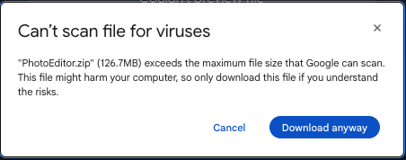
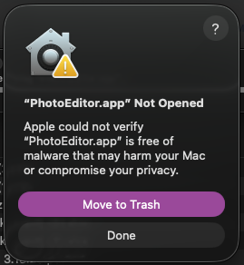
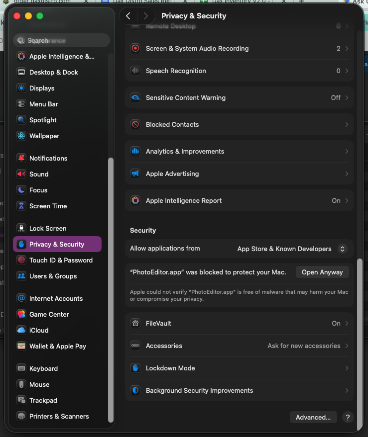
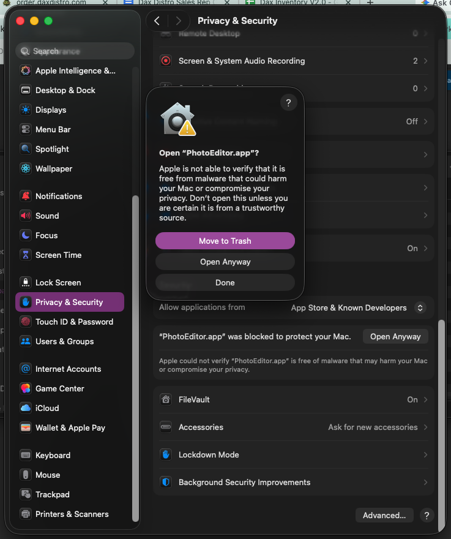

# PhotoEditor — Mac Installation Guide

> What is this? See [README.md](README.md) for project overview, pipeline, and architecture.

PhotoEditor is distributed as a standalone Mac application. Because it is not published through the Mac App Store, macOS will show several security prompts during the first launch. This is normal and expected — follow the steps below to complete the installation.

---

## Step 1: Download

Download **PhotoEditor.zip** from the shared [Google Drive](https://drive.google.com/file/d/1Mest4vtJfsJoTWyUeXFRG2bLFWaLvwVZ/view?usp=sharing). Your browser will warn that the file is too large for Google to scan for viruses.

Click **"Download anyway"** to proceed.

> This warning appears because the file exceeds Google's 100MB scan limit. The app is safe to download.

---

## Step 2: Open the App

Unzip `PhotoEditor.zip` and double-click **PhotoEditor.app** to launch it. macOS will block the app and show this warning:

**Click "Done"** — do NOT click "Move to Trash."

> macOS blocks apps from unidentified developers by default. The next steps will override this.

---

## Step 3: Allow in Privacy & Security

Open **System Settings** and navigate to **Privacy & Security**. Scroll down to the **Security** section. You will see a message:

> *"PhotoEditor.app" was blocked to protect your Mac.*

Click **"Open Anyway"**.

---

## Step 4: Confirm

macOS will show one final confirmation. Click **"Open Anyway"** to launch PhotoEditor.

> You only need to do this once. Future launches will open the app normally without any warnings.

---

## Troubleshooting

| Issue | Solution |
|-------|----------|
| "Open Anyway" not visible in Privacy & Security | You must attempt to open the app first (Step 2). The option only appears after a blocked launch attempt. |
| App won't open after clicking "Open Anyway" | Try right-clicking the app and selecting "Open" from the context menu. |
| "PhotoEditor.app is damaged" | Re-download the zip file. The archive may have been corrupted during download. |
| App opens but crashes immediately | Ensure you are running macOS 12 (Monterey) or later. |
